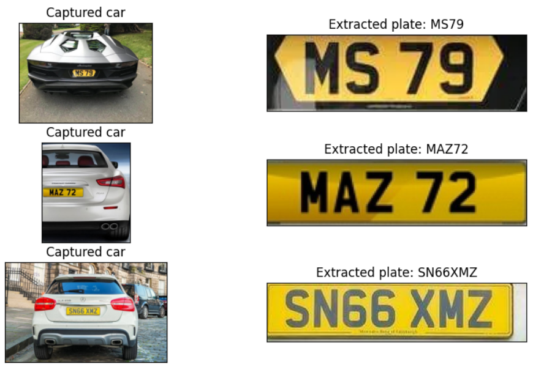
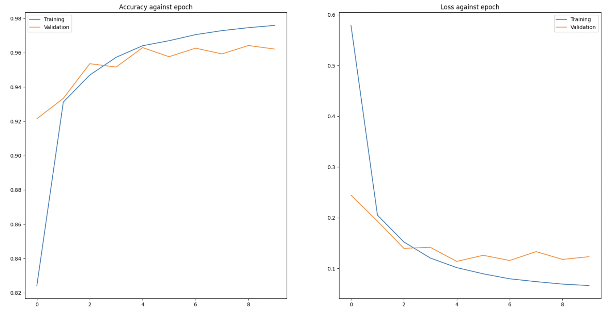
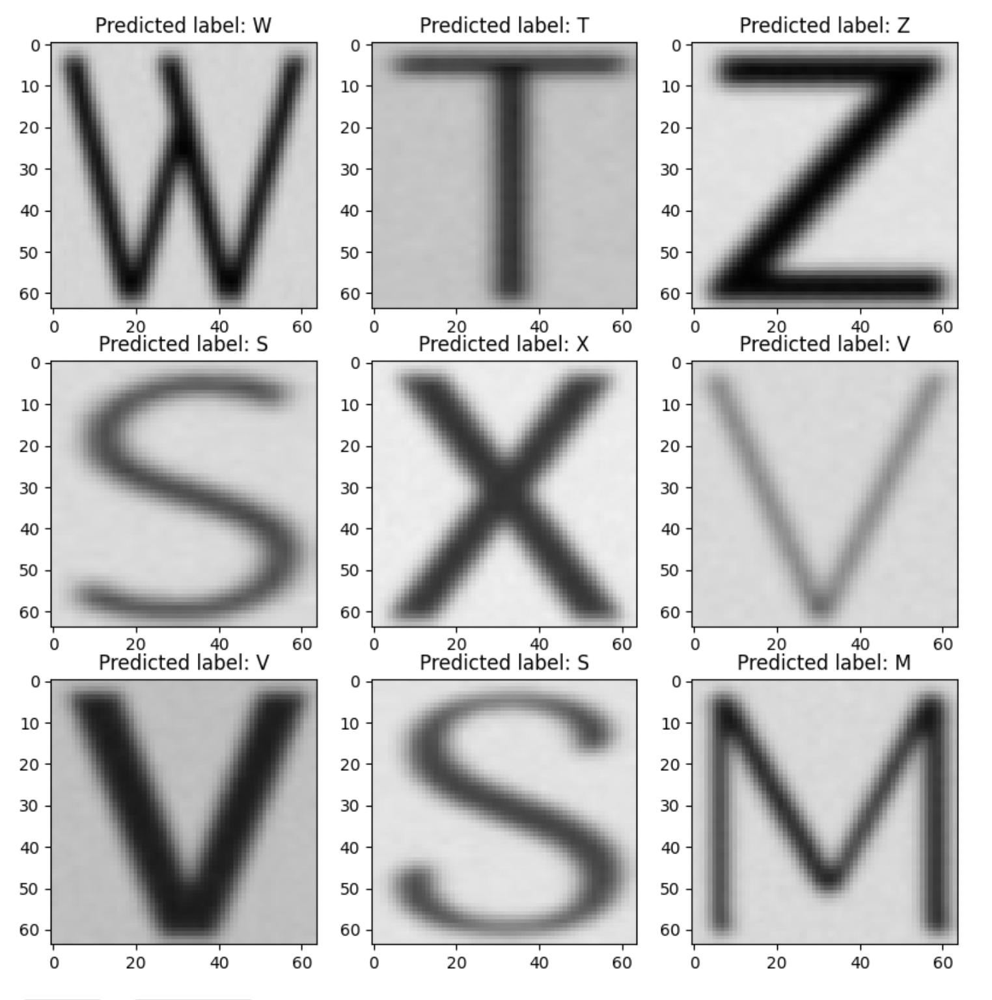

# Numberplate recognition research project

## About

This repository contains a number plate reader using a CNN trained from scratch on the OCR dataset.

## Character recognition

### Training

Neural network is trained on the standard OCR dataset which contains 50k images of characters.

In addition, data is augmented 5 times per image from a mix of rotation, translation and zooming. This attains a total train set of size 100k

### Constants

Constants used during training:

- Loss: Categorical crossentropy
- Epochs: 10
- Optimiser: Adam

### Model evaluation

After training, the test set attains an accuracy of 98.7%

Looking at the loss and accuracy per epoch we see that there are no signs of overfitting:

In addition, looking at a few test examples: 

## Number plate 

A word can be read by extracting each character from the number plate, passing it into the character model and then stringing together a word.

### Filtering characters

One similarity with every number plate is that all leters are black. Therefore, when getting an image of the number plate we can keep the black pixels and change everything else to white.

### Extracting characters and predicting words

To extract a character we can draw boxes around each character and extract the portion of that box from the image. 

Now that we have the characters, we can feed each one into the model, get the predicting and concatenate a string.

