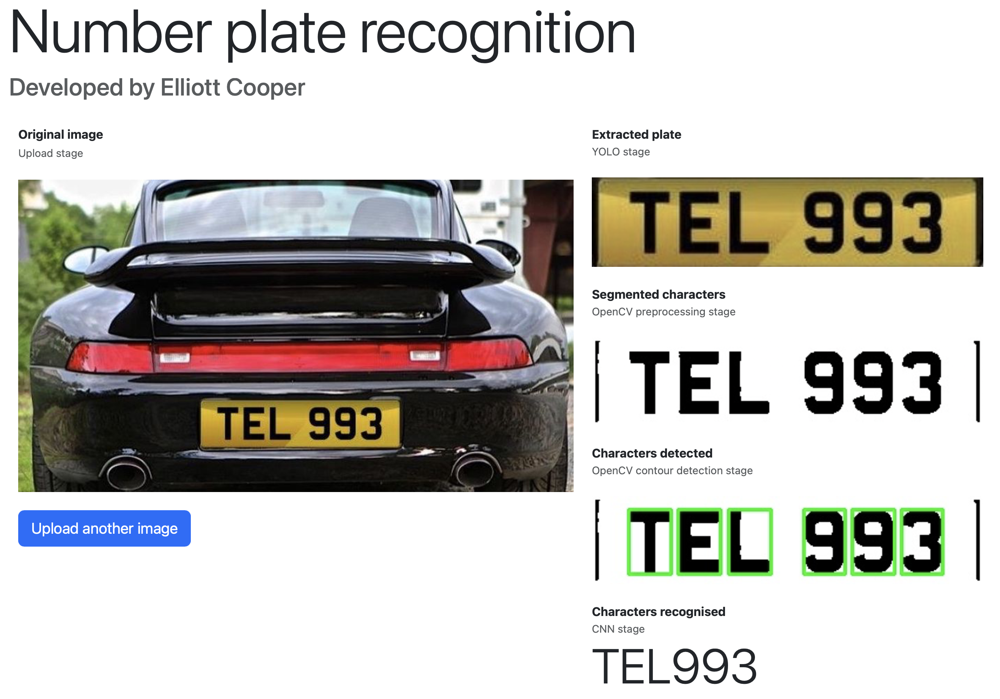
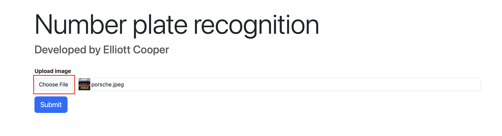
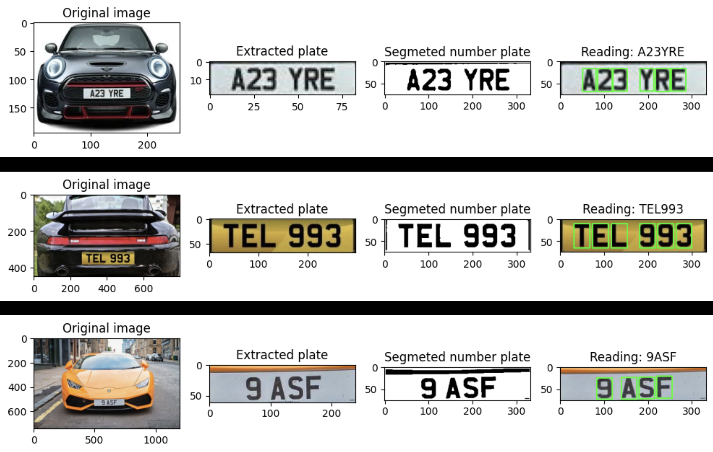
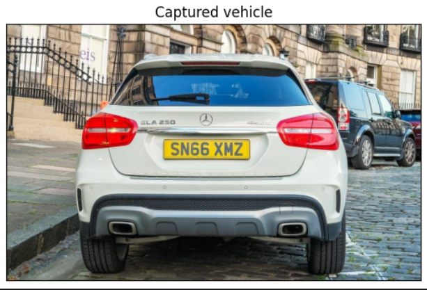
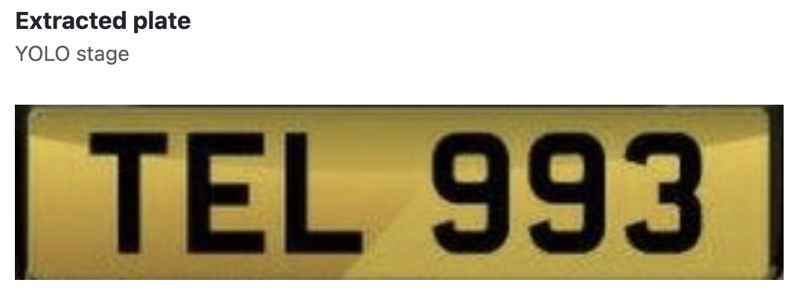
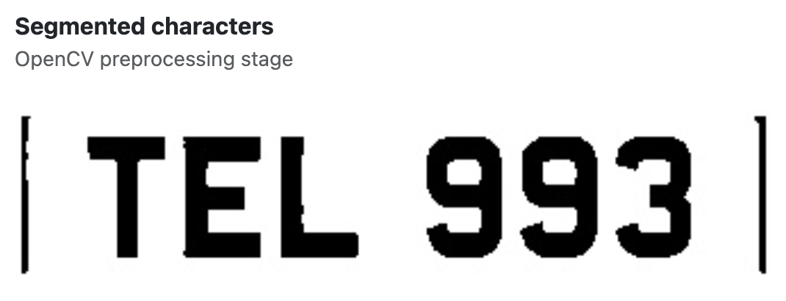
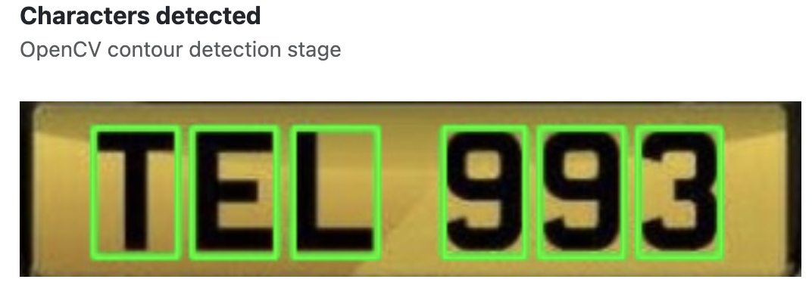
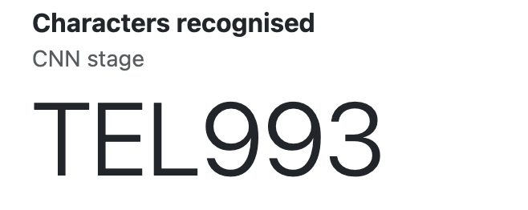

# Number plate recognition research project

## About

This repository contains a number plate reader with a Flask app, using a YOLO model for number plate extraction and a CNN trained from scratch on an OCR dataset for character recognition.

## How to setup

Assuming you are in the `Number-Plate-Recognition` directory.

1. Create a Python virtual enviroment using `python3 -m venv venv`
2. Activate venv using `source venv/bin/activate` for macos or `venv\Scripts\activate` for windows
3. Install libraries using `pip install -r requirements.txt`

## Flask app

If you want to run the interactive Flask app, navigate to the `number_plate_app` directory.

1. Run `python app.py` to locally host the app
2. Head to `http://127.0.0.1:5000` in any browser to load 
3. Choose an image with a number plate in to be recognised

4. Upload the image and each stage of the recognition process is shown

## Example notebook

If you want to walkthrough the code and see how well it performs on multiple examples, navigate to the `number_plate_code` directory.

1. Open `example.ipynb`
2. Add any test images to `example_data`
3. Run cells and analyse how well it perfroms

## Detecting a number plate

The number plate of a car can be obtained by using an object detection model. State of the art currently is YOLO (You Only Look Once) which is a deep CNN. 

The model for number plate extraction can be found [here](https://huggingface.co/nickmuchi/yolos-small-finetuned-license-plate-detection) on The Hugging Face and imported using the transformers module.

### Extraction

The model finds a bounding box of what it thinks is a number plate. With a set confidence level, we can obtain the bounding box predicted by the model, and extract the number plate from the original image.

 

## Reading a number plate

A word can be read by extracting each character from the number plate, passing it into the character model and then stringing together a word.

### Filtering characters

One similarity among all number plates is that the letters are black. Therefore, after applying image processing techniques such as edge sharpening using the Laplacian operator and Otsu thresholding, we can create a binary image with the characters as the foreground and everything else as the background.

### Extracting characters and predicting words

To extract a character, we can use the `contours` method from OpenCV, which identifies foreground objects within an image. This method creates a bounding box around each character, allowing us to extract that portion of the image.

Once we have the characters, we can feed each one into the model, obtain the predictions, and concatenate them into a string.

## Character recognition

### Training

The Neural network is trained on the standard OCR dataset which contains 50k images of characters.

The training data is augmented 5 times per image from a mix of rotation, translation and zooming. This attains a total train set of size 100k.

### Constants

Constants used during training:

- Loss: Categorical crossentropy
- Epochs: 10
- Optimiser: Adam

### Model evaluation

After training, the test set attains an accuracy of 98.7%.

Looking at the loss and accuracy per epoch we see that there are no signs of overfitting:

In addition, looking at a few test examples: 

