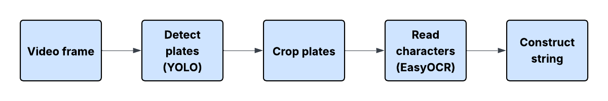
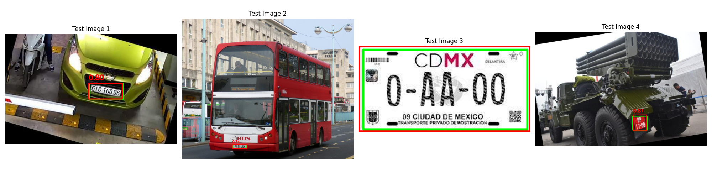
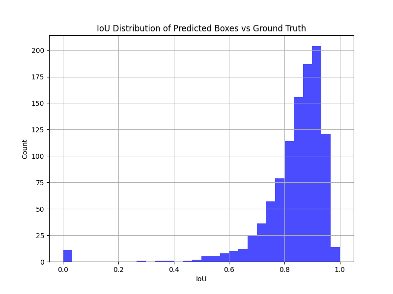
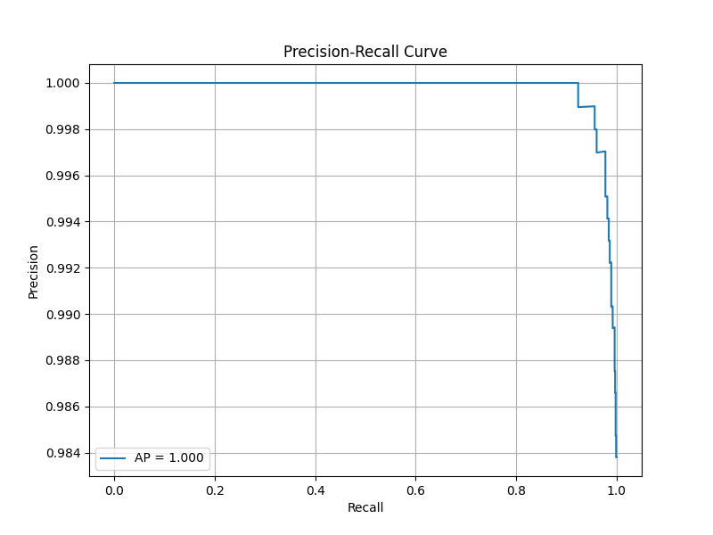

# Number Plate Recognition

## About

This repository contains a custom YOLO model trained from scratch for number plate detection. Using EasyOCR for character recognition, enabling automatic reading of vehicle number plates from videos.

## ML pipeline
The number plate recognition pipeline starts with a video frame input. Each frame is passed to YOLO, which detects and tracks number plates by predicting bounding boxes in real time. The detected plate regions are then cropped and passed to EasyOCR, which reads the characters and converts them into text strings. Finally, these recognized strings are displayed on the video.

More abstractly, the process involves:

- **Frame Input:** Raw video frames as the data source.

- **Detect plates (YOLO):** Locates and follows plates across frames.

- **Crop plates:** Crops plate from the frame. 

- **Text Recognition (EasyOCR):** Extracts characters from the detected plates.

- **Construct string:** Join extracted characters together.

## YOLO model training
The training was conducted on Kaggle using an NVIDIA TESLA P100 GPU.

### Model and Dataset

The model used was YOLOv8 nano (`yolov8n.pt`), a lightweight version of the YOLO architecture. The dataset was the License Plate Recognition dataset from Kaggle, which contains annotated images of license plates in various environments.

### Training Details

YOLO was trained from the pretrained weights, adapting to the license plate detection task. The dataset paths and class names were specified in a YAML configuration file (`dataset.yaml`).

The training ran for 30 epochs using the following settings:

- Image size: 640x640 pixels  
- Batch size: 32  
- Optimiser: YOLO's default optimiser (based on stochastic gradient descent with momentum)

## Results

The model was tested on four random samples were selected and tested against the ground truth performing well.

The IoU distribution between predicted and ground truth bounding boxes was approximately normal, centered around 0.9, indicating high overlap accuracy.

 Precision and recall both started at 1, maintaining perfect performance until recall tended to 1, where precision experienced a slight decline, reflecting a typical trade-off in detection thresholds.

 

